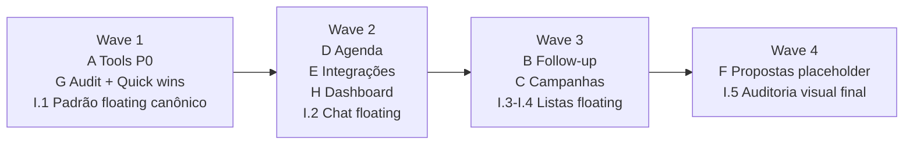

# COMERCIAL-100 — Comercial 100% pré-agentes

**Decisor:** Vinni (CEO) | **Data:** 2026-04-26
**Status:** Ready for execution
**Bloqueia:** retomada de Phase 11 (resto) + M2-03 Analista + M2-04 Campanhas + M2-05 Assistente
**Bloqueado por:** nenhum (audit @architect rodando em paralelo)

---

## 1. Resumo executivo (linguagem CEO)

Setor comercial precisa estar **100% funcional + UI premium consistente** antes de retomar a construção dos agentes V3. O agente Analista (M2-03) opera sobre o pipeline; sem dashboard de verdade, métricas reais, tools P0 e integrações funcionando, o Analista nasce cego. **Comercial incompleto = retrabalho garantido + agentes mal calibrados.**

Esse epic cobre 9 blocos paralelizáveis em 4 waves, ~175-220h totais (5-7 semanas). Ao final, o sistema entrega: **(1)** superfície operacional completa pro Atendente (17 tools cobrindo lead, conversa, mídia, agenda, busca), **(2)** painéis dedicados de Follow-up e Campanhas pra supervisão humana, **(3)** Agenda real com Google Calendar bidirecional, **(4)** Dashboard reformulado com métricas que o Analista lê pra propor ações estratégicas, **(5)** identidade visual única em padrão floating premium.

---

## 2. Decisões fundadoras (já fechadas — Vinni 2026-04-26)

| # | Decisão |
|---|---|
| 1 | Phase 11 (resto) + M2-03/04/05 **CONGELADOS** até epic completo |
| 2 | Tabs Follow-up + Campanhas = **supervisão/controle**, não pipeline separada (agente executa, operador supervisiona) |
| 3 | UI Premium refactor: **floating** em chat + lista leads + outras listas. Kanban **INTOCADO**. Chat funcional inalterado. |
| 4 | Dashboard **refazer 100%** (cards topo Vinni mapeou + métricas profundas + filtro período) |
| 5 | Propostas = **placeholder "em breve"** (zero código real V3) |
| 6 | Google Calendar OAuth precisa Vinni configurar credentials no Google Cloud Console (pré-requisito bloco D) |

---

## 3. Escopo — 9 blocos (A-I)

| Bloco | Tema | Estimativa |
|---|---|---|
| **A** | Tools P0 (6 tools + bug fix + refactor genérico) | 15-20h |
| **B** | Tab Follow-up (supervisão) | 20-25h |
| **C** | Tab Campanhas (controle) | 30-35h |
| **D** | Agenda completa + Google Calendar OAuth | 25-30h |
| **E** | Integrações refeitas (cards floating) | 15-20h |
| **F** | Propostas placeholder | 1h |
| **G** | Code health audit + quick wins | 8h + N (variável) |
| **H** | Dashboard v2 (refazer 100%) | 35-45h |
| **I** | UI Premium refactor (chat + listas floating) | 25-35h |

**Total grosso:** ~175-220h. **Calendário:** 5-7 semanas execução focada.

---

## 4. Não-escopo

- Phase 11 stories restantes (chat colab, logs SSE, brand voice, tools panel, deploy validation)
- M2-03 Analista, M2-04 Campanhas (agente IA), M2-05 Assistente
- Mobile responsivo completo (V4)
- Refactor visual do **kanban** (já está perfeito)
- Refactor funcional do chat (mantém comportamento, só estrutura visual)
- Propostas backend completo (V4 — Vinni vai detalhar feature depois)
- Reagir/encaminhar/replyToMessage no chat (UI nem tem)
- Mesclar leads (perigoso pra IA)

---

## 5. Detalhamento por bloco

### 5.1. Bloco A — Tools P0 (15-20h)

**Justificativa:** Atendente hoje cobre 40% da surface operacional (11 tools registradas vs ~32 ações reais). Sem fechar P0, agentes em produção ficam com cara de chatbot meia-boca. Detalhes em `docs/architecture/audit-tools-comercial-2026-04-26.md`.

**Stories:**

| ID | Título | Tipo | T-shirt | Dependências |
|---|---|---|---|---|
| COMERCIAL-A.1 | Refactor `atualizarLead` para patch genérico (Zod discriminated union, 10 campos) | refactor | M | — |
| COMERCIAL-A.2 | Fix bug `criarLead` duplica contato (lookup por organizationId + phone antes de insert) | bugfix | XS | — |
| COMERCIAL-A.3 | Tool `enviarMidia` (image / audio / video / document) wrappando sendMediaMessageAction | feature | M | A.7 |
| COMERCIAL-A.4 | Tool `marcarConversaResolvida` (status update RESOLVED/ARCHIVED) | feature | S | — |
| COMERCIAL-A.5 | Tool `buscarLeadOuContato` (cross-conversation search com filtros básicos) | feature | M | — |
| COMERCIAL-A.6 | Tool `comentarLead` (NOTE livre, sem forçar tipo TASK) | feature | XS | — |
| COMERCIAL-A.7 | Tool `vincularLeadAContato` (vincular sem duplicar) | feature | S | A.2 |

### 5.2. Bloco B — Tab Follow-up (20-25h)

**Função:** painel de **supervisão** da operação automatizada do Atendente. Operador agência vê quem está em follow agora, métricas, regras editáveis. Agente executa, operador supervisiona.

**Conteúdo da tab:**
- Lista quem está em follow (lead, cadência, tentativa nº, próximo disparo)
- Métricas: % resposta por tentativa, % conversão pós-follow, tempo médio resposta
- Regras editáveis (cadência, quando pausar, quando escalar humano)
- Trigger manual: forçar follow ou parar follow específico

**Stories:**

| ID | Título | Tipo | T-shirt | Dependências |
|---|---|---|---|---|
| COMERCIAL-B.1 | Schema follow-up (cadência, retentativas, status, regras) | infra | M | @data-engineer valida |
| COMERCIAL-B.2 | Backend BullMQ worker scheduler de follow-ups | feature | L | B.1 |
| COMERCIAL-B.3 | UI tab Follow-up (lista + filtros + ícones de status) | feature | M | B.1 |
| COMERCIAL-B.4 | Editor de regras de cadência (UI + server actions) | feature | M | B.1 |
| COMERCIAL-B.5 | Trigger manual + bulk actions (forçar/parar follow) | feature | S | B.2 |

### 5.3. Bloco C — Tab Campanhas (30-35h)

**Função:** painel de **controle** das campanhas em massa. Analista propõe, operador aprova, sistema dispara, painel mostra andamento. Aprovação humana obrigatória antes de qualquer disparo (Vision V3 1.7).

**Conteúdo da tab:**
- Lista de campanhas com status (rascunho / aprovação / em disparo / concluída / pausada)
- Fluxo de criação: Analista propõe lista + copy → operador revisa → aprova → dispara
- Painel ao vivo durante disparo: enviadas / lidas / responderam / converteram / opt-outs
- Anti-bloqueio dashboard com alertas (taxa anormal, opt-outs altos)
- Aprovação humana obrigatória

**Stories:**

| ID | Título | Tipo | T-shirt | Dependências |
|---|---|---|---|---|
| COMERCIAL-C.1 | Schema campanha (campaign, campaign_target, dispatch_run, opt_out) | infra | M | @data-engineer valida |
| COMERCIAL-C.2 | Backend dispatch worker (BullMQ + delay 30s±10s + opt-out automático) | feature | L | C.1 |
| COMERCIAL-C.3 | UI tab Campanhas (lista + status badges + ações) | feature | M | C.1 |
| COMERCIAL-C.4 | Fluxo criar campanha (proposta IA + revisão humana + aprovação) | feature | L | C.1, C.3 |
| COMERCIAL-C.5 | Painel ao vivo dispatch (métricas em tempo real, SSE ou polling) | feature | M | C.2, C.3 |
| COMERCIAL-C.6 | Anti-bloqueio dashboard + alertas (taxa, opt-outs, queima de número) | feature | M | C.2 |

### 5.4. Bloco D — Agenda completa (25-30h)

**Pré-requisito:** Vinni configurar credentials Google OAuth no Google Cloud Console (Calendar API + scopes apropriados).

**Stories:**

| ID | Título | Tipo | T-shirt | Dependências |
|---|---|---|---|---|
| COMERCIAL-D.1 | Backend CRUD completo (eventos, slots, disponibilidade, recorrência) | feature | L | — |
| COMERCIAL-D.2 | Schema oauth_token + Google OAuth flow (consent + refresh) | infra | M | @data-engineer valida |
| COMERCIAL-D.3 | Sync bidirecional Google Calendar (push criação/edição + pull eventos externos) | feature | L | D.1, D.2 |
| COMERCIAL-D.4 | Wirar UI agenda existente ao backend real (substituir mock) | feature | M | D.1 |
| COMERCIAL-D.5 | Convite a convidados externos via email | feature | S | D.1 |

### 5.5. Bloco E — Integrações refeitas (15-20h)

**Stories:**

| ID | Título | Tipo | T-shirt | Dependências |
|---|---|---|---|---|
| COMERCIAL-E.1 | UI tela Integrações refeita (cards floating padrão polido WA + Google) | feature | M | I.1 (depende padrão floating definido) |
| COMERCIAL-E.2 | Card WhatsApp: modal nome instância + QR code (validar/refatorar existente) | feature | S | E.1 |
| COMERCIAL-E.3 | Card Google: OAuth flow Calendar (consent screen → token storage) | feature | M | D.2, E.1 |
| COMERCIAL-E.4 | Logos reais (WA + Google) + badges de status de conexão | feature | S | E.1 |

### 5.6. Bloco F — Propostas placeholder (1h)

**Justificativa:** Vinni tem feature mapeada mentalmente mas vai detalhar em V4. Tela atual desviada. Solução: card "em breve" desabilitado pra não confundir.

**Stories:**

| ID | Título | Tipo | T-shirt | Dependências |
|---|---|---|---|---|
| COMERCIAL-F.1 | Card "Propostas" placeholder "em breve" + sidebar item disabled | feature | XS | — |

### 5.7. Bloco G — Code health audit + quick wins (8h + N)

**Status:** audit @architect rodando em background no momento da criação deste epic. Output: `docs/architecture/audit-comercial-2026-04-26.md`.

**Stories:**

| ID | Título | Tipo | T-shirt | Dependências |
|---|---|---|---|---|
| COMERCIAL-G.1 | Audit comercial completo (entregue por @architect background) | infra | M | — |
| COMERCIAL-G.2 | Aplicar quick wins P0 do audit (Vinni prioriza após receber) | refactor | variável | G.1 |
| COMERCIAL-G.3 | Aplicar refactors P1/P2 conforme priorização (entra em backlog) | refactor | variável | G.1 |

### 5.8. Bloco H — Dashboard v2 (35-45h)

**Refazer 100%.** Cards topo + métricas profundas + filtro período + gráficos padrão ouro.

**Cards topo (filtro "de até"):**
1. Leads
2. Propostas enviadas (em negociação)
3. Convertidos
4. Taxa de conversão (%)
5. Receita

**Métricas profundas:**
- Interesses (% por tipo)
- Origem (% por canal)
- Temperatura (distribuição)
- Follow-up (% resposta + % conversão pós-follow)
- Campanhas (métricas de disparo + conversão)

**Objetivo final:** agente Analista lê dashboard e propõe ações estratégicas, otimizações de processo, recalibragem da abordagem do Atendente.

**Stories:**

| ID | Título | Tipo | T-shirt | Dependências |
|---|---|---|---|---|
| COMERCIAL-H.1 | Schema agregação métricas (materialized views ou query helpers otimizados) | infra | M | @data-engineer valida |
| COMERCIAL-H.2 | Backend queries dashboard (cards topo + métricas profundas, com cache) | feature | L | H.1 |
| COMERCIAL-H.3 | UI cards topo floating com filtro período "de até" + URL state | feature | M | I.1 (padrão floating) |
| COMERCIAL-H.4 | UI gráficos métricas (Recharts ou Tremor — escolher padrão ouro) | feature | L | H.2 |
| COMERCIAL-H.5 | Empty states + loading skeletons + estados sem dados elegantes | feature | S | H.4 |
| COMERCIAL-H.6 | Drill-down em cada métrica (click na barra abre lista filtrada) | feature | M | H.4 |

### 5.9. Bloco I — UI Premium refactor (25-35h)

**Decisão Vinni:** sistema atual destoa, sem identidade visual coesa. Padrão floating em tudo (sidebar + content area já têm). Comercial precisa seguir.

| Área | Antes | Depois |
|---|---|---|
| Sidebar + content area | Floating | Mantém |
| **Chat** | Sólidos sobre fundo | Floating: painéis flutuantes sobre canvas infinito (igual editor agentes). Funcional inalterado. |
| **Kanban** | Floating polido | INTOCADO |
| **Lista de leads** | Template inline pobre | Floating |
| **Outras listas** (contatos WA, conversas) | Template inline | Floating |
| Dashboard | Cards básicos | Refazer 100% (faz parte do bloco H) |

**Stories:**

| ID | Título | Tipo | T-shirt | Dependências |
|---|---|---|---|---|
| COMERCIAL-I.1 | Definir padrão floating canônico (componentes base + tokens) | refactor | S | — |
| COMERCIAL-I.2 | Chat: estrutura visual floating (painéis flutuantes sobre canvas infinito) | refactor | L | I.1 |
| COMERCIAL-I.3 | Lista de leads: refazer pra floating | refactor | M | I.1 |
| COMERCIAL-I.4 | Listas auxiliares (contatos WA, conversas list view) → floating | refactor | M | I.1 |
| COMERCIAL-I.5 | Auditoria visual final (componentes que ainda usam template inline) | refactor | S | I.4 |

---

## 6. Sequência de ataque (waves)

**Wave 1 (paralelo):**
- Bloco A (Tools P0) — foundation, libera @dev pra wirar agentes depois
- Bloco G (audit) — read-only, descobre débitos antes de refazer
- I.1 (padrão floating) — base pros próximos blocos visuais

**Wave 2 (paralelo):**
- Bloco D (Agenda backend + Google OAuth)
- Bloco E (Integrações refeitas)
- Bloco H (Dashboard v2 — independente de outros blocos)
- I.2 (Chat floating)

**Wave 3 (paralelo):**
- Bloco B (Follow-up)
- Bloco C (Campanhas)
- I.3 + I.4 (listas auxiliares floating)

**Wave 4:**
- Bloco F (Propostas placeholder)
- I.5 (auditoria visual final + cleanup)

---

## 7. Definition of Done (epic)

- [ ] Bloco A: 6 tools P0 funcionais + bug `criarLead` corrigido + tool genérica `atualizarLead({patch})` no padrão Mastra v1.28
- [ ] Bloco B: Tab Follow-up com supervisão completa, métricas funcionais e regras editáveis
- [ ] Bloco C: Tab Campanhas com fluxo aprovação humana + dispatch worker + painel ao vivo
- [ ] Bloco D: Agenda CRUD backend + Google Calendar OAuth bidirecional funcionando
- [ ] Bloco E: Integrações UI refeita com cards floating padrão WA + Google
- [ ] Bloco F: Propostas placeholder visível e desabilitado
- [ ] Bloco G: Audit doc + P0 quick wins aplicados (P1/P2 em backlog)
- [ ] Bloco H: Dashboard v2 com cards topo + métricas profundas + filtro período + gráficos padrão ouro
- [ ] Bloco I: Chat + listas em padrão floating consistente
- [ ] Vinni aprovou visualmente cada bloco no quality gate humano
- [ ] Memória + Roadmap V3 atualizados com status pós-epic
- [ ] Phase 11 (resto) + M2-03/04/05 retomáveis (foundation pronta)
- [ ] Typecheck zero erros em web + ai + queue

---

## 8. Quality gates

Cada story termina com pausa pra Vinni testar UI antes de prosseguir. Regra MUST `quality_gate_humano`. Stories de schema/backend (sem UI direta) terminam com smoke test manual via UI relacionada.

---

## 9. Riscos

> [!warning] Riscos monitorados
> - **Scope creep:** audit (G) pode descobrir mais débitos. Aceitável até +20% do escopo. Acima disso, replanejar.
> - **Bloqueio externo:** Google Calendar OAuth precisa Vinni configurar credentials no Google Cloud Console (pré-requisito Wave 2 de D + E.3).
> - **Design drift:** sem design system formal, refactors UI podem divergir. Mitigação: I.1 define tokens/componentes canônicos antes dos demais blocos visuais.
> - **Estimativas otimistas:** ~175-220h é grosso. Stories de schema podem subir +30% em validação @data-engineer. Calendário 5-7 semanas considera margem.

---

## 10. Referências

- `docs/architecture/audit-tools-comercial-2026-04-26.md` — audit completo de tools (P0 + recomendações)
- `docs/architecture/audit-comercial-2026-04-26.md` — audit code health (em construção, @architect)
- `C:\Users\Vinni Medeiros\.claude\projects\C--Users-Vinni-Medeiros-vertech-agents\memory\project_pivot_comercial_100.md` — memória da decisão fundadora
- `C:\Users\Vinni Medeiros\Matrix\Matrix\projects\Vertech-agents\Pivot-Comercial-100.md` — versão Obsidian
- `docs/PROJECT-ROADMAP-V3.md` — roadmap V3 (atualizar com bloco Comercial 100% entre Phase 11 e M2-03)
- `docs/PROJECT-ROADMAP-V3.md` — roadmap V3 master

---

## 11. Próximos passos

1. **Roadmap V3 atualizado** com bloco "Comercial 100%" entre Phase 11 (parcial) e M2-03 (congelado)
2. **@sm (Niobe)** vai criar stories `.story.md` individuais conforme cada wave for atacada
3. **@architect** finaliza audit (bloco G) — output em `docs/architecture/audit-comercial-2026-04-26.md`
4. **@data-engineer (Dozer)** valida schemas necessários (B.1, C.1, D.2, H.1)
5. **@dev (Neo)** começa Wave 1 com bloco A (Tools P0) em foreground após audit confirmar zero migration bloqueante
6. Vinni configura Google Cloud Console credentials antes da Wave 2 (pré-requisito D)

---

**Total stories planejadas:** 42 (7+5+6+5+4+1+3+6+5)
**Total estimativa:** ~175-220h em 5-7 semanas
**Modelo de execução:** wave-based parallel, com quality gate humano por story
